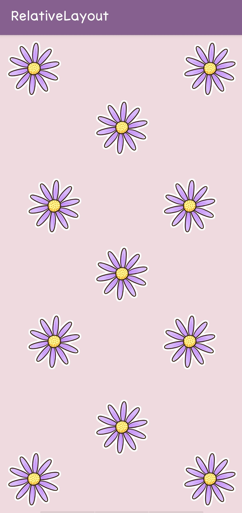

# Layout
Layout adalah penyusunan dari elemen-elemen desain yang berhubungan kedalam sebuah bidang sehingga membentuk susunan artistik. Hal ini bisa juga disebut manajemen bentuk dan bidang. Tujuan utama layout adalah menampilkan elemen gambar dan teks agar menjadi komunikatif dalam sebuah cara yang dapat memudahkan pembaca menerima informasi yang disajikan.

# Relative Layout

Relative Layout adalah jenis layout yang memiliki karakteristik dalam menempatkan view secara relatif yaitu posisi pada tiap view bergantung kepada view yang lain. Jadi, kita bebas untuk menempatkan objek yang diinginkan sesuka hati kita. Penempatan satu objek bisa dimana saja mau di sisi kanan, kiri, atas, ataupun bawah dari objek lain. Jika tidak di tetapkan, maka objek dapat menumpuk antara satu objek dengan objek yang lain.

Contoh hasil Relative Layout :

 Lebih lengkapnya bisa dilihat [disini](https://developer.android.com/guide/topics/ui/layout/relative?hl=id)
